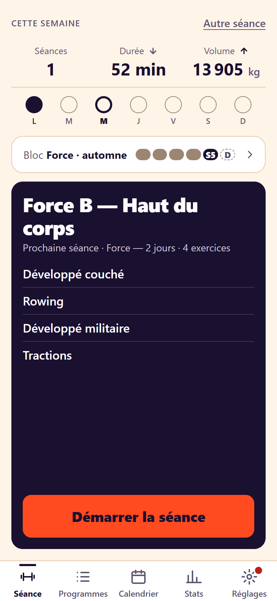
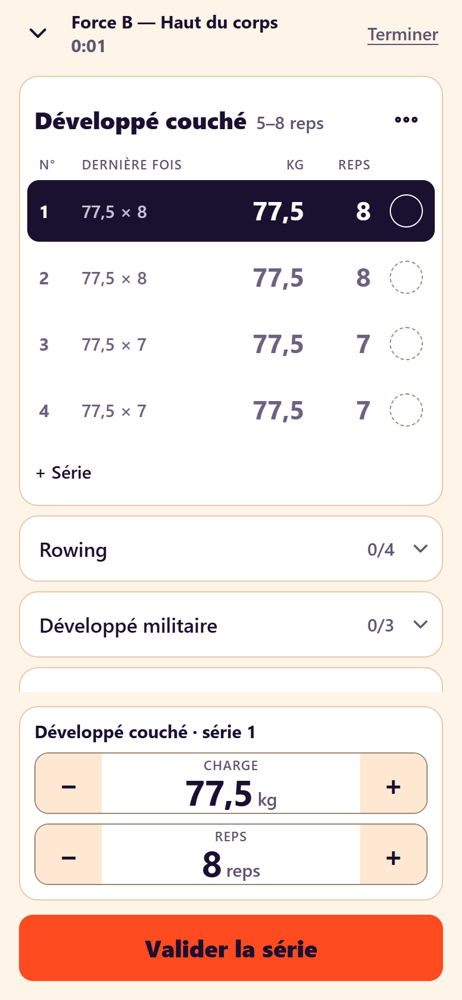
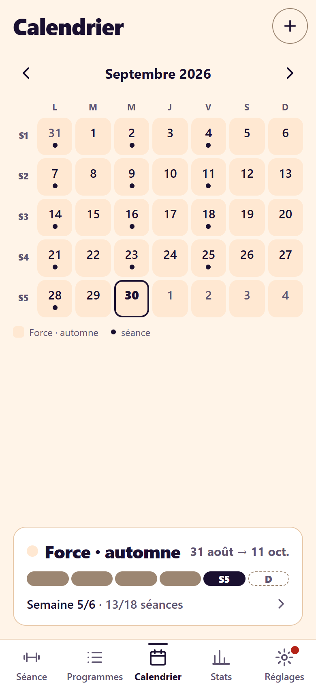
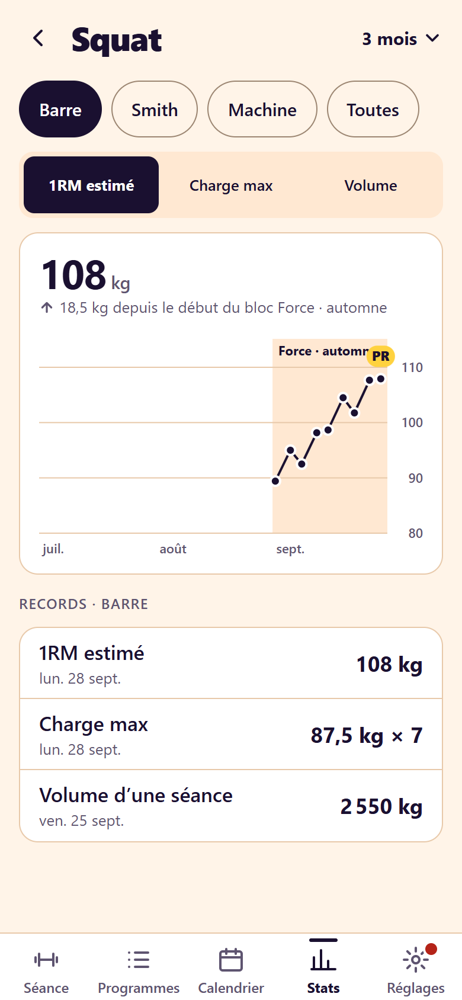

<p align="center">
  
</p>

<h1 align="center">Sportix</h1>

<p align="center"><b>Le carnet de musculation qui pense en blocs d'entraînement.</b></p>

<p align="center">
  <picture><source media="(prefers-color-scheme: dark)" srcset="docs/images/accueil-dark.png"></picture>
  <picture><source media="(prefers-color-scheme: dark)" srcset="docs/images/seance-dark.png"></picture>
  <picture><source media="(prefers-color-scheme: dark)" srcset="docs/images/calendrier-dark.png"></picture>
  <picture><source media="(prefers-color-scheme: dark)" srcset="docs/images/exercice-dark.png"></picture>
</p>

Sportix est une application de suivi d'entraînement en salle, conçue pour le téléphone. Elle se saisit d'une main entre deux séries, marche sans connexion, et garde toutes vos données sur votre appareil : pas de compte, pas de serveur, pas de publicité.

**Essayer l'app : https://ninninp.github.io/Sportix/**

Sur iPhone : ouvrir le lien dans Safari → Partager → « Sur l'écran d'accueil ». Elle s'utilise ensuite comme une app ordinaire, même en mode avion.

## Pourquoi Sportix

La plupart des carnets d'entraînement enregistrent des séances. Sportix ajoute ce qui manque pour progresser sur la durée : un **calendrier de blocs de spécialisation**. Vous planifiez une phase (par exemple 5 semaines de force, avec une semaine de deload), vos séances s'y rattachent automatiquement, et vous pouvez comparer un bloc à l'autre pour voir ce qui a vraiment marché.

## Fonctionnalités

### Pendant la séance
- **Saisie rapide** : un pavé − / + par charge et par répétitions, de gros boutons, des chiffres lisibles à un mètre.
- **Charges pré-remplies** d'après votre dernière séance, avec une **double progression** qui vous suggère quand augmenter.
- **Minuteur de repos** lancé à chaque série validée : il reste juste écran verrouillé, sonne à la fin et garde l'écran allumé.
- **Échauffements et supersets**.
- **Records** repérés au fil de la séance, puis récapitulatif.
- **Sauvegarde à chaque saisie** : fermer l'app ou la voir tuée par le téléphone ne fait rien perdre.

### Planifier
- **Programmes** : des jours d'entraînement qui tournent (A → B → A…), avec pour chaque exercice les séries, les répétitions, le repos et la progression.
- **Accueil** : la prochaine séance en un appui, les chiffres de la semaine comparés à la précédente, les jours faits.
- **Calendrier des blocs** : vue mensuelle, blocs colorés avec un objectif, une durée en semaines, un programme et une semaine de deload facultative.
- **Bibliothèque de 32 exercices**, que vous pouvez compléter et modifier, avec des variantes (barre, haltères, machine…).

### Suivre ses progrès
- **Courbe par exercice** : 1RM estimé, charge maximale ou volume, avec les blocs en arrière-plan.
- **Records**, séances par semaine, séries par muscle.
- **Comparaison de deux blocs** côte à côte.
- **Poids de corps** en moyenne sur 7 jours, et objectifs (poids cible, séances par semaine).

### Vos données vous appartiennent
- **Export et import** en un fichier JSON : changer de téléphone ou garder une copie à l'abri se fait en deux appuis.
- Un rappel discret vous invite à sauvegarder quand ça devient utile.
- Thème clair, sombre ou automatique, et des animations discrètes (le réglage « Réduire les animations » d'iOS est respecté).

## Installer et lancer en local

Prérequis : Node 24 (voir `.nvmrc`).

```bash
npm install          # installe les dépendances
npm run dev          # lance l'app → http://localhost:5173/Sportix/
npm test             # lance les tests (npm test -- --run pour une seule exécution)
npm run lint         # vérifie le code (oxlint)
npm run build        # vérifie TypeScript et construit la version de production dans dist/
npm run preview      # sert dist/ pour tester le mode hors ligne
```

## Sous le capot

Vite · React 19 · TypeScript · Tailwind CSS v4 · React Router · Dexie (IndexedDB) · `vite-plugin-pwa` · Vitest. Graphiques en SVG maison.

```
src/lib/         calculs purs et testés (progression, records, repos, blocs, stats, sauvegarde)
src/db/          base Dexie : schéma, migrations versionnées, export/import
src/features/    écrans par fonctionnalité
src/components/  composants d'interface partagés
design/          tokens de design et maquettes
docs/            plan du projet
```

Les conventions de développement sont dans [`CLAUDE.md`](CLAUDE.md) et le plan complet dans [`docs/PLAN.md`](docs/PLAN.md).
