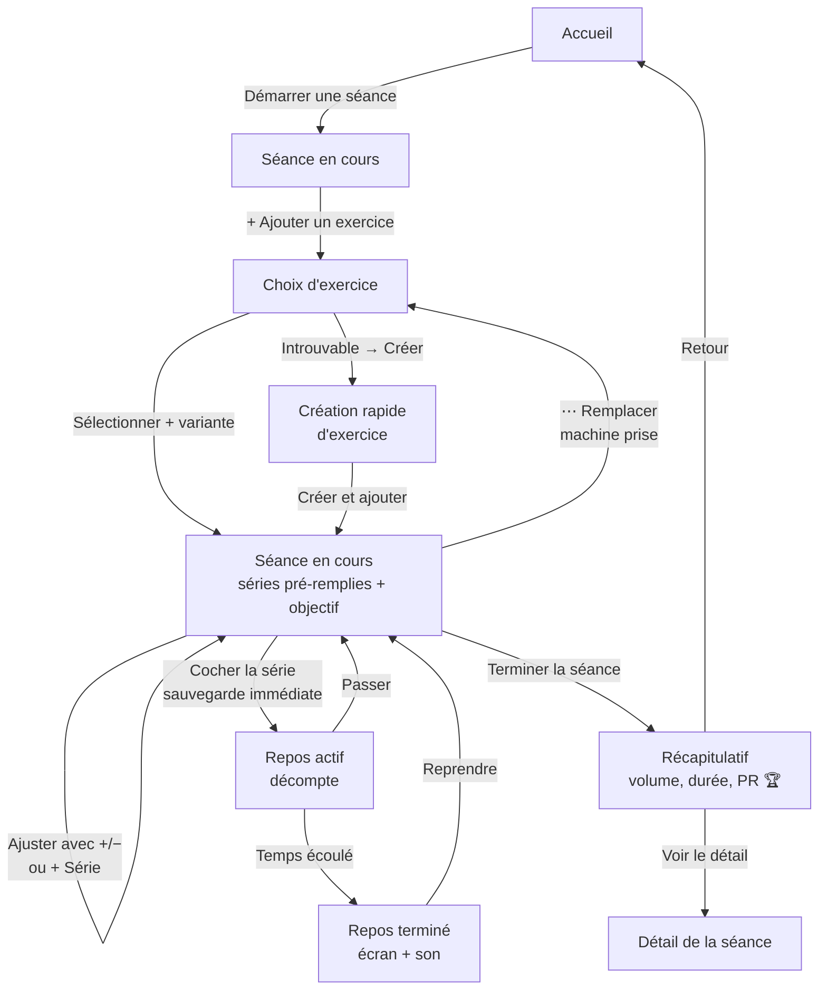
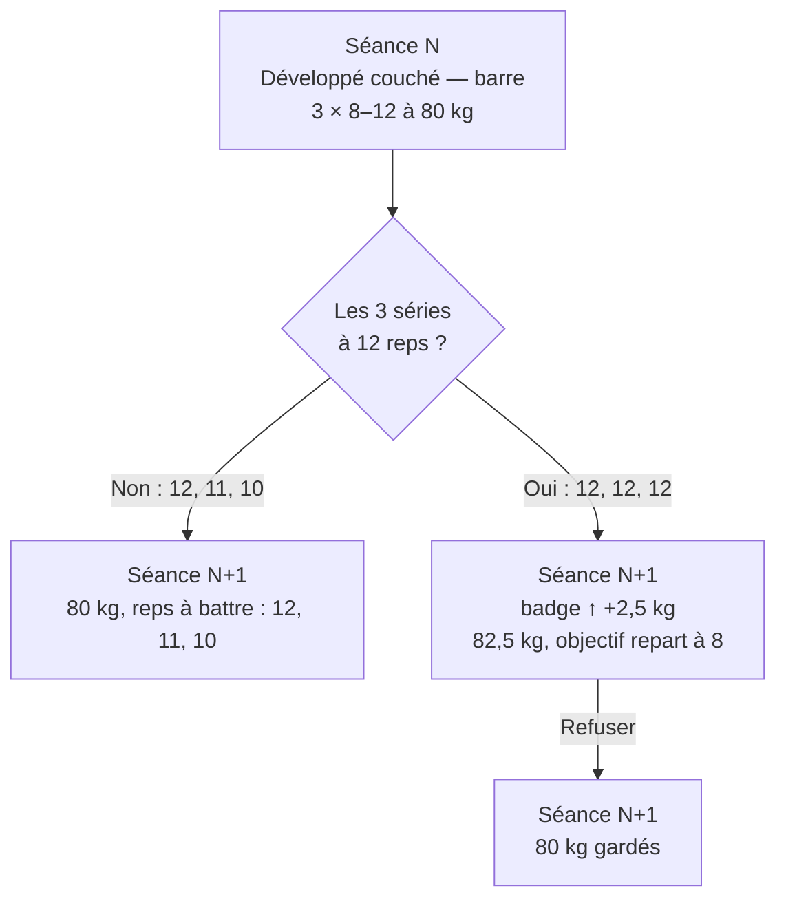
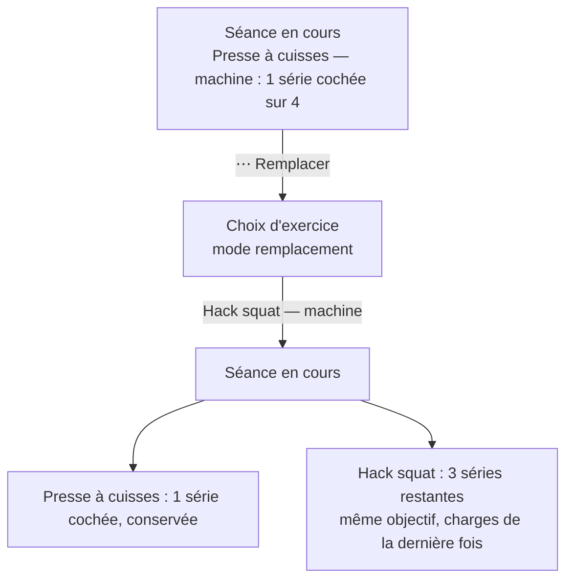
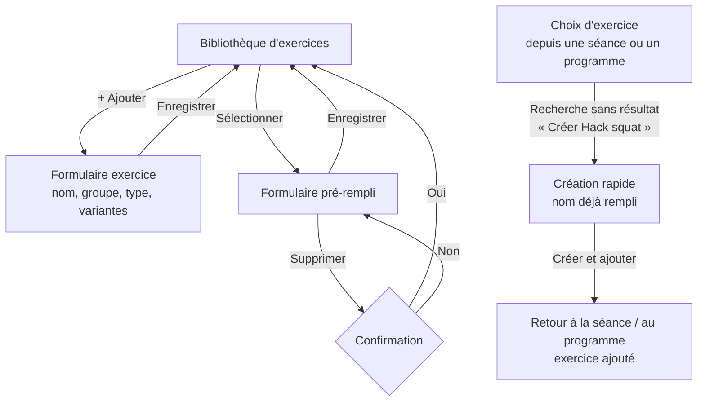
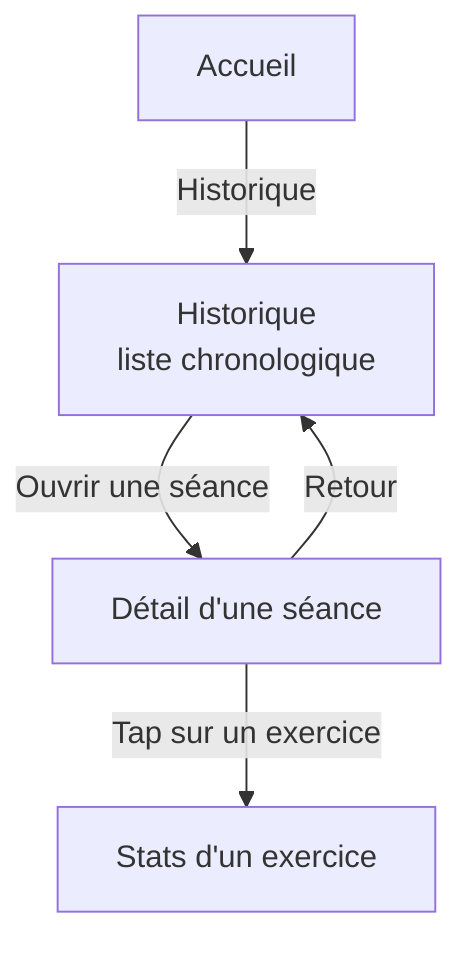
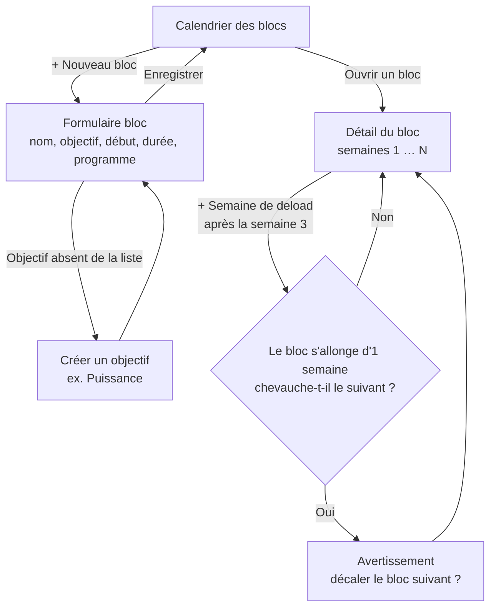
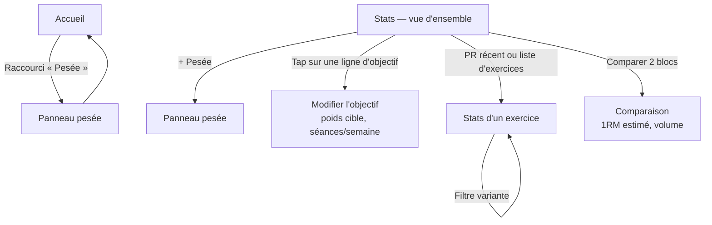
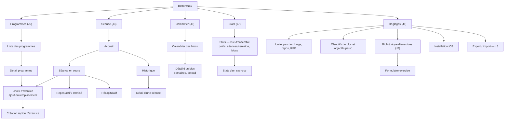

# D1 — Parcours & écrans

> Livrable de l'étape D1 de la [Phase D](../PHASE-D.md). Ce document sert de base à D2 (wireframes). Il ne dessine rien : il décrit *quels* écrans existent, *comment* on passe de l'un à l'autre, et il tranche les questions métier qui influencent leur contenu.
>
> Historique :
> - **v2 (17/09/2026)** : pré-remplissage, boutons de saisie, remplacement d'exercice, création d'exercice à la volée, variantes d'équipement, deload, objectifs de bloc libres.
> - **v3 (17/09/2026)** : double progression, Barre et Haltères séparées, graphiques perso (poids, séances/semaine) avec lignes d'objectif.
> - **v4 (17/09/2026)** : regroupement d'écrans de la v3 annulé (on revient aux écrans séparés et aux 5 onglets) ; la Smith devient une variante à part entière.

**Vocabulaire**
- Un **onglet** est une entrée de la barre de navigation du bas (BottomNav). Il y en a 5.
- Un **écran** est une page de l'app ; chaque onglet en contient un ou plusieurs.
- Un **panneau** est une feuille qui monte du bas de l'écran, par-dessus la page, et se ferme d'un glissement.

## 1. Inventaire des écrans

| Écran | Onglet | Jalon | Rôle | Informations affichées | Action principale |
|---|---|---|---|---|---|
| **Accueil** | Séance | J3 → J5/J6/J7 | Point d'entrée : lancer une séance | Bloc actif (semaine X/Y, deload signalé) dès J6 ; séance du jour dès J5 ; raccourci pesée dès J7 ; sinon « Démarrer une séance » | Démarrer une séance |
| **Séance en cours** | Séance | J3 | Cœur de l'app, utilisé en salle | Exercices et leur variante ; séries pré-remplies ; objectif de reps ; badge ↑ charge ; repère « dernière fois » | Cocher une série · `+ Série` · boutons +/− |
| **Repos actif / terminé** | Séance | J4 | Minuteur entre deux séries | Décompte en gros chiffres, +15 s, passer ; à la fin, l'écran change franchement de couleur et un son est joué | Passer / reprendre |
| **Choix d'exercice** | Séance | J3 | Ajouter **ou remplacer** un exercice | Recherche, filtre par groupe musculaire, choix de la variante, « Créer un exercice » | Sélectionner · créer à la volée |
| **Création rapide d'exercice** (panneau) | — | J2/J3 | Créer un exercice sans quitter la séance ou le programme | Nom (pré-rempli avec la recherche), groupe musculaire, type, variantes | Créer et ajouter |
| **Fin de séance / récapitulatif** | Séance | J3 | Clore la séance et valoriser l'effort | Durée, volume total, PR 🏆, objectifs atteints (↑ charge la prochaine fois) | Terminer |
| **Historique** | Séance | J3 | Consulter les séances passées | Liste chronologique (date, programme/bloc, résumé) | Ouvrir une séance |
| **Détail d'une séance** | Séance | J3 | Revoir une séance terminée | Exercices, variantes, séries, objectifs | Retour |
| **Bibliothèque d'exercices** | Réglages | J2 | Gérer les exercices | Liste, recherche, groupe musculaire, variantes | Ajouter / modifier / supprimer |
| **Formulaire exercice** | Réglages | J2 | Créer / modifier un exercice | Nom, groupe musculaire, type (charge / poids du corps / temps), variantes acceptées | Enregistrer |
| **Programmes** | Programmes | J5 | Lister les routines | Programmes et leurs jours | Créer / ouvrir un programme |
| **Détail programme** | Programmes | J5 | Construire un programme | Jours (ex. « Push ») ; pour chaque exercice : variante, séries, **fourchette de reps**, repos | Ajouter un jour / un exercice |
| **Calendrier des blocs** | Calendrier | J6 | Vue mensuelle de la périodisation | Blocs, semaines de deload, bloc actif mis en évidence | Créer / ouvrir un bloc |
| **Détail d'un bloc** | Calendrier | J6 | Suivre et ajuster un bloc | Objectif, dates, programme, semaines (dont deload), séances rattachées, progression | + Semaine de deload · modifier |
| **Stats — vue d'ensemble** | Stats | J7 | Page d'accueil des graphiques | Poids corporel, séances/semaine, régularité, séries par muscle, PR récents, comparaison de blocs | Ouvrir un exercice · + Pesée |
| **Stats d'un exercice** | Stats | J7 | Progression d'un exercice | 1RM estimé, charge max, volume, PR ; filtre par variante ; blocs en fond, deload grisé | Changer de variante / de période |
| **Pesée** (panneau) | — | J7 | Saisir le poids du jour | Poids (boutons +/− par 0,1 kg, pré-rempli avec la dernière pesée), date | Enregistrer |
| **Réglages** | Réglages | J1 → J8 | Paramètres et maintenance | Unité, pas de charge par variante, repos par défaut, RPE, objectifs de bloc, objectifs perso, bibliothèque, installation iOS, export/import | Modifier un réglage |

## 2. Règles de la séance en cours

### 2.1 Double progression
Le programme fixe, pour chaque exercice, un **nombre de séries** et une **fourchette de reps à atteindre** (ex. 3 × 8–12). On peut aussi fixer une valeur unique (ex. 3 × 5).

- Les reps du programme sont un **objectif**, affiché sur chaque série (« obj. 12 »). Ce n'est **pas** une valeur à valider telle quelle.
- On garde la **même charge** tant que **toutes les séries** n'ont pas atteint le **haut de la fourchette**. Une série qui atteint l'objectif reçoit un repère ✓.
- Quand toutes les séries l'ont atteint, la fois suivante l'app **propose d'augmenter la charge** d'un pas (badge « ↑ +2,5 kg — objectif atteint la dernière fois »), et l'objectif de reps repart du **bas de la fourchette**. On peut refuser et garder la charge.
- En **séance libre** (sans programme), l'objectif repris est celui utilisé la dernière fois pour cet exercice. On peut le modifier via `⋯` → « Objectif ». Si l'exercice n'a jamais eu d'objectif, il n'y en a pas.
- Les séances faites pendant une semaine de deload ne déclenchent pas de proposition d'augmentation.

### 2.2 Pré-remplissage
Quand un exercice arrive dans la séance, ses séries sont créées automatiquement :

| Valeur | Source |
|---|---|
| **Nombre de séries** | Programme ; sinon dernière séance de cet exercice (même variante) ; sinon 1 |
| **Objectif de reps** | Programme ; sinon dernier objectif utilisé ; sinon aucun |
| **Charge** | Dernière fois (même variante), **+ un pas** si la double progression le propose ; sinon vide |
| **Reps** | Reps faites la dernière fois sur *cette* série : c'est le score à battre. Sinon bas de la fourchette. |

Les valeurs pré-remplies restent en **gris clair** tant que la série n'est pas cochée. Un tap sur « fait » valide la série. Si on a fait plus de reps, on appuie d'abord sur `+`.

Exemple de ligne de série :
`Série 2 │ 80 kg [−][+] │ 10 reps [−][+]  obj. 12 │ ☐`
avec, sous le nom de l'exercice, le repère « dernière fois : 80 kg × 12, 11, 10 ».

### 2.3 Saisie par boutons
- **Charge** : `−` / `+` avec le pas de charge de la variante (§ 5). Un tap sur le chiffre ouvre le pavé numérique.
- **Reps** : `−` / `+` par pas de 1.
- **`+ Série`** sous chaque exercice : ajoute une série qui copie la précédente.
- **Retirer une série** : glisser la ligne vers la gauche.
- Chaque tap est **sauvegardé immédiatement**.

### 2.4 Menu d'un exercice (`⋯`)
- **Remplacer l'exercice** (ex. machine prise) : ouvre « Choix d'exercice » en mode *remplacement*. Les séries déjà cochées restent sur l'exercice d'origine. Les autres passent au nouvel exercice, avec le même nombre de séries et le même objectif ; la charge vient de la dernière fois du nouvel exercice.
- **Changer de variante** : on garde l'exercice ; les charges et la « dernière fois » sont reprises pour la nouvelle variante.
- **Objectif** : modifier la fourchette de reps pour cette séance.
- **Supprimer de la séance**.

## 3. Parcours clés (diagrammes Mermaid)

### 3.1 Séance complète (J3 + J4)

### 3.2 Double progression d'une séance à l'autre

### 3.3 Remplacer un exercice pendant la séance

### 3.4 Créer un exercice (J2, et à la volée en J3/J5)

### 3.5 Consulter l'historique (J3)

### 3.6 Blocs et deload (J6)

### 3.7 Stats et poids corporel (J7)

## 4. Arborescence de navigation

La **BottomNav** a **5 onglets**. Ils sont présents dès le J1 (coquille) et se remplissent au fil des jalons :

- Si une séance est en cours, l'onglet **Séance** ouvre directement la séance, et non l'Accueil.
- La **bibliothèque d'exercices** est rangée dans les Réglages, car c'est un écran de gestion. Pendant l'entraînement, on crée les exercices à la volée depuis « Choix d'exercice ».

## 5. Questions métier tranchées

### Variantes d'équipement
Il y a cinq variantes : **Barre · Smith · Haltères · Machine · Poulie**. Le type « poids du corps » reste un *type* d'exercice, et non une variante.
- **Smith** est une variante à part : ses charges ne se comparent ni à la barre libre (la trajectoire est guidée, la barre est parfois contrebalancée), ni aux autres machines. « Squat — Smith » et « Squat — machine » (ex. pendulum, belt squat) restent donc distincts.
- Un exercice déclare les variantes qu'il accepte (ex. « Développé couché » : barre, haltères, machine).
- On choisit la variante quand on ajoute l'exercice à une séance ou à un programme, et on peut en changer via `⋯`.
- La « dernière fois », la double progression et les stats sont **séparées par variante**. Un filtre des stats permet de regrouper les variantes.
- **Haltères** : la charge saisie est celle d'**un** haltère, et l'étiquette l'indique (« 30 kg / haltère »). Le volume compte ×2.

### Pas de charge
Le pas est **réglable par variante** dans les Réglages. Valeurs par défaut :
- Barre 2,5 kg
- Smith 2,5 kg
- Haltères 2 kg
- Machine 5 kg
- Poulie 2,5 kg

Un tap sur le chiffre ouvre le pavé numérique pour les autres valeurs.

### RPE
**Masqué par défaut**, activable dans les Réglages.

### Contenu de l'accueil
- **J3** : bouton « Démarrer une séance » + accès à l'historique.
- **J5** : ajoute « Séance du jour » quand un programme est actif.
- **J6** : ajoute en haut le bandeau « Bloc Force — semaine 2/4 » (ou « semaine 3/5 · Deload »).
- **J7** : ajoute un petit raccourci « Pesée » (dernier poids + bouton).

### Objectifs de bloc
**C'est l'utilisateur qui les crée.** L'app n'en fournit qu'un, en exemple : « Force » (modifiable, supprimable). Ils sont enregistrés dans une liste réutilisable, pour que les blocs restent comparables au J7.

### Semaines de deload
- Dans le détail d'un bloc : « + Semaine de deload » à la position choisie. Le bloc s'allonge d'une semaine.
- Si le bloc chevauche alors le suivant, l'app avertit et propose de décaler le bloc suivant.
- Les séances de deload restent rattachées au bloc, mais elles sont **exclues des comparaisons** (grisées sur les graphiques) et ne déclenchent pas la double progression.
- Une semaine de deload peut être retirée.

### Contenu des stats
**Stats — vue d'ensemble**
- **Poids corporel** : points des pesées + **moyenne sur 7 jours** (le poids varie beaucoup d'un jour à l'autre) + **ligne d'objectif** (poids cible).
- **Séances par semaine** : barres + **ligne d'objectif** (ex. 4/semaine).
- **Régularité** : grille des jours entraînés sur les dernières semaines, comme les contributions GitHub.
- **Séries par groupe musculaire par semaine**, avec une **zone d'objectif** (ex. 10–20 séries/semaine).
- **PR récents** 🏆, et accès à la liste des exercices.
- **Comparaison de 2 blocs** : 1RM estimé au début et à la fin, et volume, pour les exercices communs.

**Stats d'un exercice** (choix de la variante)
- 1RM estimé (Epley), charge max et volume par séance, historique des PR.
- Les périodes des blocs apparaissent en fond coloré, et les semaines de deload sont grisées.

Les objectifs perso (poids cible, séances/semaine, zone de séries) se modifient en touchant la ligne d'objectif sur le graphique, ou dans les Réglages.

*Pour plus tard (J9, si besoin)* : mensurations (tour de bras, de taille…) sur le même modèle que le poids.

### « Dernière fois » pendant la saisie
Repère discret sous le nom de l'exercice (« dernière fois : 80 kg × 12, 11, 10 »), en plus des reps à battre pré-remplies sur chaque série (§ 2.2).

## 6. Impact sur le modèle de données

Reporté dans [`docs/PLAN.md`](../PLAN.md) :
- `exercises` : + `variantes` (barre / smith / haltères / machine / poulie).
- `programExercises` : + `variante` ; les reps cibles deviennent une fourchette `repsMin` / `repsMax`.
- `sets` : + `variante`, + `repsMin` / `repsMax` (objectif en vigueur pendant la série, pour que l'historique reste juste si le programme change ensuite).
- nouvelle table `blockGoals` (« Force » fournie en exemple) ; `blocks.objectif` devient `blocks.goalId`.
- `blocks` : + `deloadWeeks`.
- nouvelle table `bodyWeights` : id, date, poids.
- `settings` : + pas de charge par variante, + RPE affiché, + objectifs perso (poids cible, séances/semaine, zone de séries/muscle/semaine).

## 7. Prochaine étape

Une fois ce document validé, on passe à **D2 — Wireframes basse fidélité** (skill `design`) : **9 planches** en niveaux de gris.

1. Accueil
2. Séance en cours, en 3 états :
   - saisie pré-remplie, avec objectif, badge ↑ charge, boutons +/− et `+ Série` ;
   - repos actif / terminé ;
   - menu `⋯`.
3. Choix d'exercice (avec le panneau de création rapide)
4. Historique
5. Programmes (détail d'un jour, fourchettes de reps)
6. Calendrier des blocs (avec une semaine de deload)
7. Stats — vue d'ensemble (poids + objectif, séances/semaine + objectif)
8. Stats d'un exercice
9. Réglages (pas de charge par variante, encart d'installation iOS)
